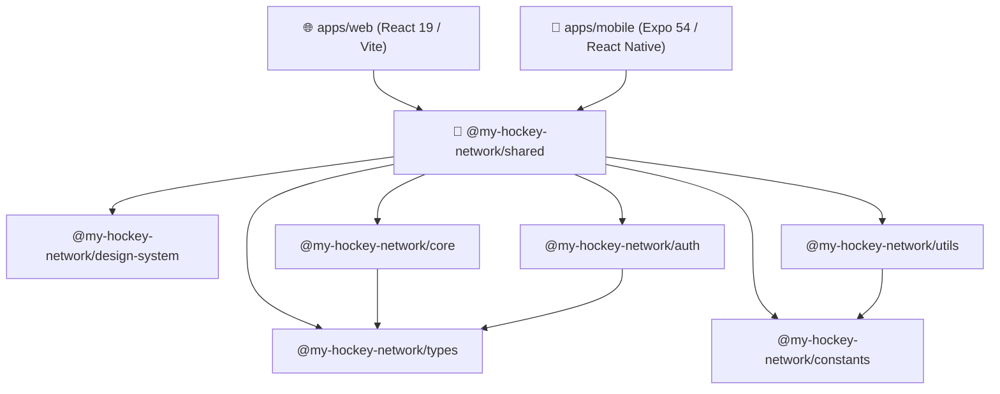

# Staff Engineer Monorepo Architecture Guide — My Hockey Network

This document presents the complete architectural specification for **My Hockey Network**, a production-grade enterprise monorepo supporting **Web (`apps/web`)** and **Mobile (`apps/mobile`)**.

---

## 1. Monorepo Directory Architecture

```
my-hockey-network/
├── 📄 package.json                          # Root workspace manifest (npm workspaces)
├── 📄 tsconfig.json                         # Base TypeScript configuration
├── 📄 .npmrc                                # Workspace peer-dependency resolution config
├── 📁 apps/
│   ├── 📁 web/                              # @my-hockey-network/web (React 19 + Vite + Tailwind v4)
│   │   ├── 📄 vite.config.ts                # Vite config with package aliases
│   │   ├── 📄 index.html                    # Single Page App shell
│   │   ├── 📁 public/                       # Static public assets (Welcome, calendar, social)
│   │   └── 📁 src/
│   │       ├── 📄 main.tsx                  # Client mount entry point
│   │       ├── 📄 App.tsx                   # Web container shell
│   │       ├── 📄 index.css                 # Custom CSS & solid white canvas tokens
│   │       └── 📁 components/features/     # OnboardingModal & CreateAccountModal
│   └── 📁 mobile/                           # @my-hockey-network/mobile (Expo 54 + React Native 0.81)
│       ├── 📄 app.config.ts                 # Expo application manifest
│       ├── 📄 babel.config.js               # Module resolver aliases
│       ├── 📄 metro.config.js               # Metro bundler single-instance React configuration
│       ├── 📄 App.tsx                       # Root React Native shell (Redux Provider & PersistGate)
│       ├── 📁 assets/images/                # Native bundled image assets
│       └── 📁 src/
│           ├── 📁 navigation/               # RootNavigator & MainTabs navigation stacks
│           ├── 📁 redux/                    # Redux Toolkit store, CommonReducer, ApiReducer
│           └── 📁 screens/                  # OnboardingScreen & SignupScreen
├── 📁 packages/
│   ├── 📁 types/                            # @my-hockey-network/types (DTOs, Role & Auth contracts)
│   ├── 📁 constants/                        # @my-hockey-network/constants (Routes, Colors, Copy, Keys)
│   ├── 📁 design-system/                    # @my-hockey-network/design-system (Color tokens, Spacing, Radius)
│   ├── 📁 theme/                            # @my-hockey-network/theme (Light/Dark theme rules)
│   ├── 📁 assets/                           # @my-hockey-network/assets (Asset path registries)
│   ├── 📁 config/                           # @my-hockey-network/config (Environment & Feature flags)
│   ├── 📁 utils/                            # @my-hockey-network/utils (Validators, Formatters, Helpers)
│   ├── 📁 core/                             # @my-hockey-network/core (Domain rules, Transformers)
│   ├── 📁 api/                              # @my-hockey-network/api (Axios HTTP client & Interceptors)
│   ├── 📁 store/                            # @my-hockey-network/store (Redux Toolkit store & Slices)
│   ├── 📁 auth/                             # @my-hockey-network/auth (Auth session logic & Permissions)
│   ├── 📁 forms/                            # @my-hockey-network/forms (Form validation schemas)
│   ├── 📁 hooks/                            # @my-hockey-network/hooks (Shared React hooks)
│   ├── 📁 i18n/                             # @my-hockey-network/i18n (Shared i18next translations)
│   ├── 📁 services/                         # @my-hockey-network/services (Analytics, Push notifications)
│   └── 📁 ui/                               # @my-hockey-network/ui (Cross-platform component abstractions)
└── 📁 docs/                                 # Enterprise architecture guide & package specs
```

---

## 2. Package Responsibility Matrix

| Package Name | Purpose & Responsibility | Key Export Symbols |
| :--- | :--- | :--- |
| `@my-hockey-network/types` | Central contracts for data structures, DTOs, and interface contracts. | `RoleOption`, `RoleId`, `UserProfile`, `CreateAccountDTO` |
| `@my-hockey-network/constants` | Single source of truth for routes, color hexes, copy strings, and storage keys. | `ROUTES`, `BRAND_COLORS`, `ONBOARDING_STRINGS`, `CREATE_ACCOUNT_STRINGS` |
| `@my-hockey-network/design-system` | Design tokens specifying spacing, typography, radii, and shadows. | `SPACING`, `RADII`, `TYPOGRAPHY`, `SHADOWS` |
| `@my-hockey-network/utils` | Pure utility functions for validation, string formatting, and debouncing. | `isValidEmail`, `sanitizeEmail`, `validatePassword`, `debounce` |
| `@my-hockey-network/core` | Pure domain business rules, role selection mutations, and mappers. | `toggleRoleSelection`, `formatRoleName`, `mapCreateAccountDTOToUserProfile` |
| `@my-hockey-network/auth` | Session contracts, login/logout state management, and permission checkers. | `hasRole`, `createAuthSession`, `clearAuthSession` |
| `@my-hockey-network/shared` | Unified barrel library re-exporting all common domain packages. | Re-exports all shared packages |

---

## 3. Dependency & Import Flow Architecture



---

## 4. Best Practices & Design Principles

1. **Single Source of Truth**: All copy, colors, and types are exported from shared packages (`@my-hockey-network/*`). Zero duplication across Web and Mobile.
2. **SOLID & Clean Architecture**: Screens in `apps/web` and `apps/mobile` only handle rendering and user navigation. All state mutations and data validations are delegated to domain packages.
3. **Single React Instance in Monorepos**: Metro in `apps/mobile` is configured with `extraNodeModules` and `nodeModulesPaths` pointing strictly to root `node_modules/react` to prevent duplicate React runtime errors.
